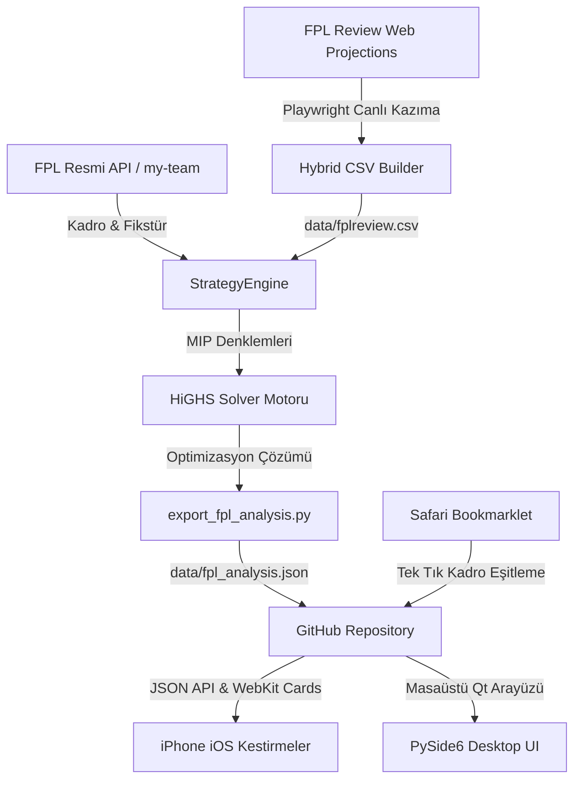

# ⚽ FPL Helper & Strategy Solver

<div align="center">


**Yapay Zeka ve Yöneylem Araştırması (MIP) Destekli Fantasy Premier League Strateji & Optimizasyon Asistanı**

[Özellikler](#-temel-özellikler) • [Mimari](#-sistem-mimarisi) • [Mobil & Kestirmeler](#-iphone--ios-kestirmeler-entegrasyonu) • [Kurulum](#-kurulum--kullanım) • [Matematiksel Motor](#-matematiksel-model--çözücü)

</div>

---

## 📌 Genel Bakış

**FPL Helper**, Fantasy Premier League menajerlerinin haftalık transfer, ilk 11 dizilişi, kaptan seçimi ve uzun vadeli çip (Wildcard, Free Hit, Bench Boost, Triple Captain) stratejilerini **Karma Tamsayılı Doğrusal Programlama (Mixed-Integer Linear Programming - MIP)** algoritmalarıyla optimize eden yeni nesil bir strateji platformudur.

Sistem; masaüstü **PySide6 / Qt** arayüzü, bulutta otomatik çalışan **GitHub Actions** çözücü hattı ve cebinizden tek tıkla erişebileceğiniz **iPhone Kestirmeler (Shortcuts)** ekosistemiyle uçtan uca senkronize çalışır.

---

## ✨ Temel Özellikler

### 1. 🧠 HiGHS MIP Çok Dönemli Optimizasyon Motoru
* 8 haftalık hareketli ufukta (*rolling 8-gameweek horizon*) puan beklentisini (xP) ve transfer maliyetlerini maksimize eder.
* Bütçe, mevki kotaları, takım sınırları (maksimum 3 oyuncu), transfer cezaları (-4 hit) ve serbest transfer devirlerini (*Roll FT*) dinamik simüle eder.
* **Golden Path:** Gelecek 8 haftanın haftalık transfer ve çip yol haritasını üretir.

### 2. 🕷️ Canlı FPL Review Kazıma & Hibrit Veri Motoru (`fplreview_scraper.py`)
* Başsız Chromium tarayıcısı (Playwright) ile `app.fplreview.com` üzerinden en güncel elit projeksiyonları ve beklenen dakikaları (xMins) otomatik kazır.
* Resmi Premier League veritabanı ile **%100 hatasız kimlik eşleştirmesi** (`fuzzy token sort` + takım ve mevki doğrulaması) yapar.
* Kalan tüm lig oyuncularını yerleşik **Poisson & Elo olasılık modelleriyle** tamamlayarak eksiksiz bir `data/fplreview.csv` veri seti oluşturur.

### 3. 📱 iPhone iOS Kestirmeler & WebKit Arayüzü
* iPhone 13 mini ve tüm iOS cihazlarla tam uyumlu, kenarlıksız **OLED Koyu Tema (`#070a12`)** zengin web kartları.
* **Modüler Menü:**
  * 🎯 **Haftalık Transfer:** Giren/çıkan oyuncu, bütçe değişimi ve stratejik gerekçeler.
  * 📋 **İlk 11 Kadrosu & Diziliş:** O haftanın tek maçına göre en yüksek xP'li 11 ve kaptan (2x).
  * 🛣️ **Stratejik Yol Haritası:** 8 haftalık Golden Path planı.
  * 🃏 **Çip & Zamanlama:** Çip durumları ve kullanım tavsiyesi.
  * 🏥 **Sağlık & Fiyat Radarı:** Sakatlık olasılıkları ve beklenen fiyat artış/düşüş alarmları.

### 4. ⚡ Safari Tek Tık Kadro Senkronizasyonu (Bookmarklet)
* FPL mobil uygulamasında veya Safari'de kadro değiştirdiğinizde, şifreye veya e-postaya gerek kalmadan Safari Yer İmleri'nden tek tıkla `data/synced_team.json` dosyasını GitHub'a aktarır ve çözücüyü anında tetikler.

### 5. 🤖 GitHub Actions & Telegram Bulut Otomasyonu
* Telegram Botu (`/analiz`, `/maclar`, `/kaptan`, `/optimal` vb.) veya manuel tetikleme (*workflow dispatch*) ile isteğe bağlı bulut çözücü ve anlık analiz desteği.
* Çözülen güncel stratejileri `data/fpl_analysis.json` olarak yayınlar ve Telegram üzerinden zengin rapor olarak iletir.

---

## 🏗️ Sistem Mimarisi



---

## 📂 Proje Dizin Yapısı

```text
├── .github/workflows/
│   └── fpl_solver.yml          # Bulut optimizasyon ve otomatik commit workflow'u
├── core/
│   ├── solver/
│   │   ├── service.py          # HiGHS Solver servis orkestratörü
│   │   ├── data_parser.py      # CSV ve veri standardizasyon motoru
│   │   ├── projection_generator.py # Yerleşik Elo & Poisson xP üreteci
│   │   └── multi_period_mip.py # Çok dönemli tamsayılı programlama modeli
│   └── strategy_engine.py      # Ana strateji ve karar demeti (DecisionBundle)
├── ingestion/
│   ├── fpl_client.py           # Resmi FPL REST API istemcisi
│   ├── fplreview_scraper.py    # Playwright canlı FPL Review kazıyıcı
│   ├── auth_manager.py         # Oturum ve kimlik doğrulama yönetimi
│   └── local_sync_server.py    # Tarayıcı kadro senkronizasyon sunucusu
├── ui/
│   ├── views/                  # Masaüstü Transfer, Kadro, Fikstür ve Dashboard ekranları
│   ├── viewmodels/             # MVVM asenkron iş parçacığı yöneticileri
│   └── widgets/                # FDR Isı Haritası, Taktik Tahtası ve Modern Kartlar
├── data/
│   ├── fpl_analysis.json       # Mobil kestirme ve API için üretilen canlı veri
│   ├── fplreview.csv           # Harmanlanmış hibrit projeksiyon veri tabanı
│   └── synced_team.json        # Senkronize edilmiş kullanıcı kadro taslağı
├── export_fpl_analysis.py      # Başsız (headless) JSON ve WebKit kart üretici
├── main.py                     # Masaüstü PySide6 uygulamasını başlatan dosya
└── requirements.txt            # Proje bağımlılıkları
```

---

## 📱 iPhone / iOS Kestirmeler Entegrasyonu

### 1. Canlı Analiz Kestirmesi Kurulumu
1. iPhone'unuzda **Kestirmeler (Shortcuts)** uygulamasını açın.
2. **URL İçeriğini Al:** `https://api.github.com/repos/Kraiser61/FPL-Helper/contents/data/fpl_analysis.json`
   * *Üstbilgiler:* `Accept: application/vnd.github.v3.raw`, `User-Agent: iOS`
3. **JSON'dan Değeri Al:** `cards.transfer` *(veya `cards.lineup`, `cards.golden_path`)*
4. **Adı Ayarla:** `kart.html`
5. **Göz At (Quick Look):** `kart.html`

### 2. Safari Tek Tık Senkronizasyon Yer İmi (Bookmarklet)
Safari'de `fantasy.premierleague.com` sayfasındayken tek tıkla kadronuzu GitHub'a aktarmak için Yer İmleri adresine ekleyin:

```javascript
javascript:(async function(){var ghToken="GITHUB_TOKEN";var repo="Kraiser61/FPL-Helper";var mgrId=3842372;try{var bearerToken="";for(var i=0;i<localStorage.length;i++){var k=localStorage.key(i);var v=localStorage.getItem(k);if(v&&v.indexOf("eyJ")!==-1){try{var p=JSON.parse(v);bearerToken=p.access_token||p.token||bearerToken;}catch(e){if(v.indexOf("eyJ")===0)bearerToken=v;}}}for(var i=0;i<sessionStorage.length;i++){var k=sessionStorage.key(i);var v=sessionStorage.getItem(k);if(v&&v.indexOf("eyJ")!==-1){try{var p=JSON.parse(v);bearerToken=p.access_token||p.token||bearerToken;}catch(e){if(v.indexOf("eyJ")===0)bearerToken=v;}}}var fplHeaders=new Headers();if(bearerToken)fplHeaders.set("authorization","Bearer "+bearerToken);var r=await fetch("/api/my-team/"+mgrId+"/",{headers:fplHeaders});if(!r.ok){alert("⚠️ FPL Oturumu Doğrulanamadı: "+r.status+" (Lütfen FPL sayfasını yenileyin)");return;}var teamData=await r.json();var payload={manager_id:mgrId,team_data:teamData,synced_at:new Date().toISOString()};var contentStr=JSON.stringify(payload,null,2);var b64=btoa(unescape(encodeURIComponent(contentStr)));var ghGetHeaders=new Headers();ghGetHeaders.set("authorization","Bearer "+ghToken);ghGetHeaders.set("accept","application/vnd.github+json");var getR=await fetch("https://api.github.com/repos/"+repo+"/contents/data/synced_team.json",{headers:ghGetHeaders});var sha="";if(getR.ok){var getJ=await getR.json();sha=getJ.sha;}var putBody={message:"sync: Update team data from mobile Safari",content:b64};if(sha)putBody.sha=sha;var ghPutHeaders=new Headers();ghPutHeaders.set("authorization","Bearer "+ghToken);ghPutHeaders.set("content-type","application/json");ghPutHeaders.set("accept","application/vnd.github+json");var putR=await fetch("https://api.github.com/repos/"+repo+"/contents/data/synced_team.json",{method:"PUT",headers:ghPutHeaders,body:JSON.stringify(putBody)});if(putR.ok){fetch("https://api.github.com/repos/"+repo+"/actions/workflows/fpl_solver.yml/dispatches",{method:"POST",headers:ghPutHeaders,body:JSON.stringify({ref:"main"})});alert("✅ Kadronuz GitHub'a eşitlendi ve analiz motoru başlatıldı!");}else{alert("❌ GitHub Yükleme Hatası: "+putR.status);}}catch(e){alert("Hata: "+e);}})();
```

---

## 💻 Kurulum & Kullanım

### Gereksinimler
* Python 3.11 veya üstü
* Git

### Yerel Kurulum
```bash
# 1. Depoyu klonlayın
git clone https://github.com/Kraiser61/FPL-Helper.git
cd FPL-Helper

# 2. Bağımlılıkları yükleyin
pip install -r requirements.txt

# 3. Playwright tarayıcı motorunu kurun
python -m playwright install chromium

# 4. Masaüstü arayüzünü başlatın
python main.py
```

### Başsız (Headless) Çözücüyü Çalıştırma
```bash
# Analiz JSON'ı ve Hibrit FPL Review CSV'sini doğrudan üretin
python export_fpl_analysis.py
```

---

## 📊 Matematiksel Model & Çözücü

Strateji motoru aşağıdaki optimizasyon problemini çözer:

$$\max \sum_{t=1}^{T} \left( \sum_{i \in \text{Start}} \text{xP}_{i,t} + \text{xP}_{\text{Cap},t} + \sum_{j \in \text{Bench}} w_j \cdot \text{xP}_{j,t} - \text{HitCost} \cdot \text{Penalties}_t \right)$$

**Temel Kısıtlar:**
* $\sum_{i} \text{Cost}_i \le \text{Budget}_t$ *(£100.0m Bütçe Sınırı)*
* $\sum_{i \in \text{Team}_k} x_{i,t} \le 3 \quad \forall k$ *(Aynı takımdan en fazla 3 oyuncu)*
* Kadro Formasyonu: 2 GKP, 5 DEF, 5 MID, 3 FWD (İlk 11'de min. 1 GKP, min. 3 DEF, min. 1 FWD)
* Serbest Transfer devir mantığı ($\text{FT}_{t+1} = \min(5, \text{FT}_t - \text{Transfers}_t + 1)$)

---

## 📄 Lisans & Telif
Bu proje kişisel strateji ve analiz amacıyla geliştirilmiştir. Tüm hakları saklıdır.

